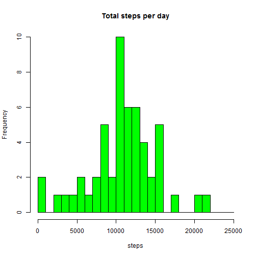
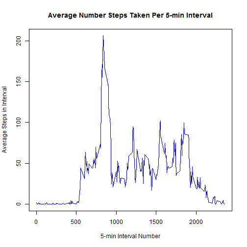
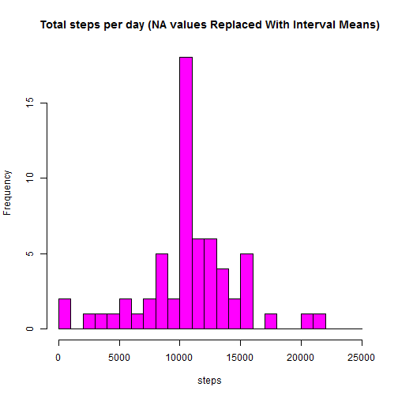

## Introduction

It is now possible to collect a large amount of data about personal movement using activity monitoring devices such as a Fitbit, Nike Fuelband, or Jawbone Up. These type of devices are part of the 'quantified self' movement, a group of enthusiasts who take measurements about themselves regularly to improve their health, to find patterns in their behavior, or because they are tech geeks. But these data remain under-utilized both because the raw data are hard to obtain and there is a lack of statistical methods and software for processing and interpreting the data.

## Data

This assignment makes use of data from a personal activity monitoring device. This device collects data at 5 minute intervals through out the day. The data consists of two months of data from an anonymous individual collected during the months of October and November, 2012 and include the number of steps taken in 5 minute intervals each day.


The data for this assignment can be downloaded from the course web site: [Activity monitoring data](https://d396qusza40orc.cloudfront.net/repdata%2Fdata%2Factivity.zip) [52K]

The variables included in this dataset are:

- steps: Number of steps taking in a 5-minute interval (missing values are coded as NA)


- date: The date on which the measurement was taken in YYYY-MM-DD format


- interval: Identifier for the 5-minute interval in which measurement was taken


The dataset is stored in a comma-separated-value (CSV) file and there are a total of 17,568 observations in this dataset.

##1. Loading Data and Pre-processing

The target data is a CSV file containing NA values so two versions of the raw data are processed and kept. rawD contains NA values while raw has NA values omitted.

```r
rawD <- read.csv("activity.csv")
raw <- na.omit(rawD)
raw$date <- as.Date(raw$date, "%Y-%m-%d")
```
##2. What is the mean total number of steps taken per day?
In this case the data source is 'raw' and we aggregate 'steps' against 'date' using sum.

```r
df <- aggregate ( steps ~ date, data=raw, sum, na.rm=TRUE)
hist(df$steps, breaks=seq(from=0, to=25000, by=1000), main = "Total steps per day", xlab = "steps", col = "green")
```

 

```r
m <- mean(df$steps)
med <- median(df$steps)
```
The mean number of steps per day is   **10766.19**  
The median number of steps per day is **10765**


##3. What is the average daily activity pattern?
In this case we the data source is 'raw' and we aggregate 'steps' against 'interval' using mean.

```r
df <- aggregate (steps ~ interval, data = raw, mean, na.rm=TRUE)
plot( df$interval, df$steps, type = "l", xlab = "5-min Interval Number", 
     ylab = "Average Steps in Interval", main = "Average Number Steps Taken Per 5-min Interval", 
     col = "blue")
```

 

```r
maxInx <- which.max(df$steps)
```

The maximum number of steps is   **206.17**  in interval  **835**

##4. Inputing missing values

Note that there are a number of days/intervals where there are missing values (coded as NA). The presence of missing days may introduce bias into some calculations or summaries of the data.

The strategy we use is to replace NA values with the mean value of steps across all days for a given interval. To do this we create a lookup table which has the same number of days and intervals as the original data frame. We then search in the original data frame for NA values and replace with a value from the lookup table


```r
NApos <- is.na(rawD)
countNA <- sum(NApos)
lookup <- rep(df$steps,61)

rawD[NApos, "steps"] <- lookup[NApos]
df <- aggregate ( steps ~ date, data=rawD, sum)
hist(df$steps, breaks=seq(from=0, to=25000, by=1000), main = "Total steps per day (NA values Replaced With Interval Means)", xlab = "steps", col = "magenta")
```

 

```r
m <- mean(df$steps)
med <-median(df$steps)
```
The total number of NA values in the original data was **2304**  
The mean after NA replacement is  **10766.19**   
The median value after NA replacement is **10766**  
The effect of NA replacement does not affect the mean and median values much.

##5. Are there differences in activity patterns between weekdays and weekends?
In this case we use the 'rawD' data which contains NA values. We use the factor function to create a date factor variable dfactor which has two levels and add it as a column to 'rawD'. We then aggregate the modified rawD using 'steps' against 'interval' and 'dfactor'. We then plot the results using a lattice xy plot.


```r
d <- as.Date(rawD$date)
wkdays = c('Monday', 'Tuesday', 'Wednesday', 'Thursday', 'Friday')
dfactor <- factor ( (weekdays(d) %in% wkdays)+1L, levels=1:2, labels=c('weekend','weekday'))
rawD$dayfactor <- dfactor
df <- aggregate (steps ~ interval + dayfactor, data = rawD, mean)

library(lattice)
g <- xyplot(steps ~ interval | dayfactor, df, type = "l", layout = c(1, 2), 
       xlab = "Interval", ylab = "Number of steps")
print(g)
```

 
